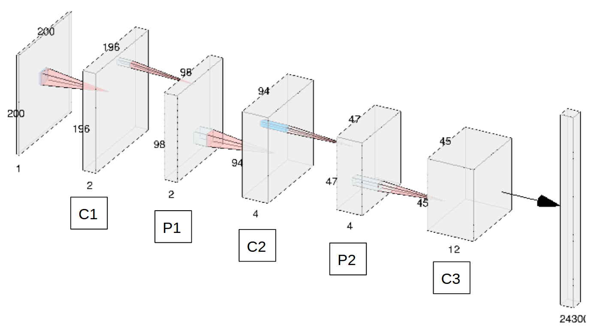

# Image-Driven-Machine-Learning-Approach-for-Microstructure-Classification-and-Segmentation-Ti-6Al-4V

## Table of Contents

1. [Directory Structure](#directory-structure)
2. [Objective](#objective)
3. [Publication Link](#publication-link)
4. [Usage Instructions](#usage-instructions)

### Directory Structure

```
.
├── cnnarch.png
├── Images1
├── Images2
├── labels.xlsx
├── LICENSE
├── README.md
├── src
│   ├── aux_funcs.py
│   ├── lib_imports.py
│   ├── main.py
│   └── model_params.py
└── weights
    ├── checkpoint
    ├── classification.ckpt.data-00000-of-00001
    └── classification.ckpt.index
     
```


### Objective: 

The primary objective of this work is to implement an algorithm for contextual segmentation of morphological features in a material microstructure dataset. Towards this goal, a task pipeline has been designed, which classifies the micrographs into a target class and subsequently implements label-specific image segmentation algorithm for each image. The classification is performed by training a Convolutional Neural Network. The architecture used for the network is shown here: 


Once a label is assigned to every image, they are passed to an appropriate feature segmentation function in accordance with the classified label. For example, evey image that is classified as containing a duplex microstructure is passed to a function that can extract the area fraction of globular grains using a watershed algorithm. Such a pipeline can be implemented for systems for which there is a prior knowledge of morphologies demonstrated by the system. 

The repository contains the following data:

* Raw Images: These are distributed across the folders Images1 and Images2 (because Github wouldn't allow more than a 1000 files in a sub-directory). Images has 1000 images and Images_v2 has 225 files. ## Do not treat one folder for training and the other for testing, as the images are not shuffled across classes. While running the code, make sure that the directory path for loading the images is correct. In the code provide in Pipeline_Instance.py, the images are assumed to be in the same directory as the source code. Hence, modify the line *filename = 'image_' + str(i) + '.png'*, as *filename = 'Directory/image_' + str(i) + '.png'*.

* Labels: The labels for each image in the Images1 and Images2 folders have been listed in the files labels.xlsx. Labels 1,2,and 3 refer to lamellae, bi-modal, and martensitic microstructures respectively.

* Pre-trained weights: A set of pre-trained weights for this CNN has been provided in the Keras_Implementation_Demo repository. 

* Pipeline-Demo: A Python implementation of the pipeline has been provided in the Keras_Implementation_Demo sub-repository. The source file offers the reader the option to either load pre-trained weights, or play around with the hyper-parameters to train the network from scratch. 


### Publication Link

This is supplementary data to the peer-reviewed publication, [Adaptive characterization of microstructure dataset using a two stage machine learning approach](https://www.sciencedirect.com/science/article/abs/pii/S0927025620300847). 

### Usage Instructions

The source code in src can be used in the following ways:


```

main.py <mode>

```

mode = "train", "load" 

* The complete implementation of the code trains the neural network using 1000 images and 100 images for validation, tests the trained neural network on a held-out dataset of 125 images, and performs label-specific segmentation. mode: "train"

* Alternatively, a set of trained weights have also been provided. These weights have been trained on a dataset of 1000 images, and resulted in an accuracy of 94% on a held-out dest set. The user can test these weights on a randomly selected test set. This might, however, result in the scenario of testing the classifier on images used for training the classifier. The user may also test the trained network on different image datasets. mode: "load"

* Care should be taken to ensure the correct filepaths for loading the images and weights. 


